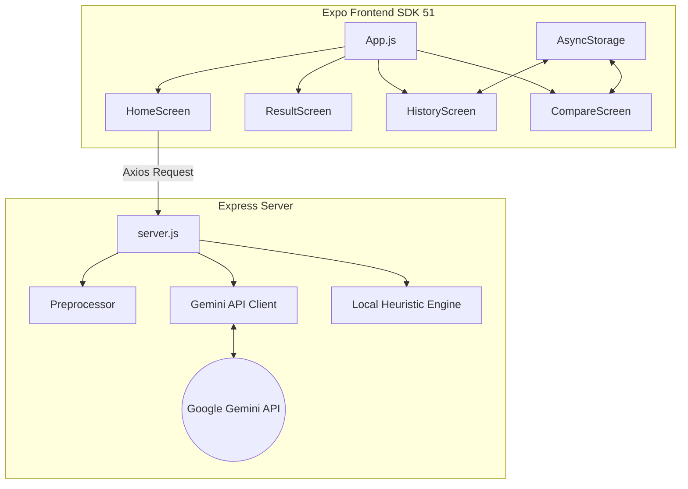

# Decision Simulator AI 🧠🌌

An advanced decision-science and cognitive-modeling application that combines predictive Generative AI simulations with a stunning sci-fi terminal interface. The system standardizes user decision queries, detects cognitive biases, models alternative future scenarios, and runs a structured advisor debate to help users evaluate trade-offs objectively.

---

## 🚀 Key Features

### 1. Futuristic Sci-Fi Terminal User Interface
* **Bioluminescent Visual Design**: Harmonious dark-mode UI styled with glowing cyan/purple HSL gradients and glassmorphism.
* **Micro-Animations**: Smooth diagonal radar sweeps, typewriter-effect headers, radial cosmic background gradients, and progress bar load fills.
* **Asynchronous Font Loading**: Auto-loads premium fonts (`Orbitron` and `IBM Plex Mono`) asynchronously using `expo-font` with styled ActivityIndicator fallback screens.

### 2. Semantic Preprocessing & Normalization
* **Query Standardization**: Automatically removes conversational prefix fluff (e.g. *"please help me decide if I should..."*) and standardizes queries into clear analytical statements.
* **Levenshtein Correction**: Preprocesses inputs using a custom Levenshtein spelling correction algorithm to correct phonetic typos (e.g., *"desrt"* ➔ *"desert"*, *"stomacth"* ➔ *"stomach"*).

### 3. Dual Simulation Engines (AI & Fallback Heuristics)
* **Generative AI Simulation**: When configured with a Gemini API key, the system calls `gemini-2.5-flash` to construct custom, context-rich decision breakdowns including timelines, risk ratings, and detailed systems analyses.
* **Intelligent Local Fallback**: If offline or if the API key is missing, a rule-based simulator matches keywords (health, food, productivity, pets, career) and generates high-fidelity structural outcomes, boardroom debates, and key factors.

### 4. Advanced Cognitive Modeling
* **Cognitive Bias Engine**: Analyzes queries for loaded language, temporal discounting, and false dichotomies. Calculates a **Bias Score (0-100)** and reports details on specific detected biases.
* **Boardroom Debate**: Simulates a structured discussion between two distinct advisor lenses:
  * *Logical & Behavioral Perspective*: Focuses on cognitive patterns, immediate impulses, and emotional framing.
  * *Risk & Sustainability Perspective*: Analyzes long-term viability, resource preservation, and environmental trade-offs.
* **Confidence Assessment**: Evaluates the reliability of the simulation (High/Moderate/Low Confidence score) and details three specific real-world limitations.

### 5. Persistent Memory & Comparative Analytics
* **AsyncStorage History**: Saves all simulated decisions, configurations, and results locally. Allows users to view and delete past logs.
* **Decision Comparer**: Contrast any two simulated decisions side-by-side. Evaluates differences in risk profiles, confidence ratings, and outcomes.

---

## 🛠️ Architecture & Tech Stack



### Frontend (React Native & Expo)
* **Core**: React Native 0.74.5, Expo SDK 51, React 18.2.0.
* **Navigation**: React Navigation v6 (`@react-navigation/native` & `@react-navigation/native-stack`).
* **Persistence**: `@react-native-async-storage/async-storage` for local history.
* **Font Loading**: `expo-font` loading `@expo-google-fonts/orbitron` and `@expo-google-fonts/ibm-plex-mono`.
* **Dynamic Network Routing**: Auto-detects the host IP using `expo-constants` to route API requests directly from phones/emulators without manual setup.

### Backend (Node.js & Express)
* **Server**: Express.js with CORS middleware.
* **AI Model**: Google Gemini API (`gemini-2.5-flash`).
* **Environment**: `dotenv` for configuration.

---

## ⚡ Getting Started

### Prerequisites
* Node.js (v18+)
* npm (v9+)
* Expo Go app installed on your physical device (if testing native Android/iOS)

### 1. Backend Configuration & Setup
1. Navigate to the `backend/` folder:
   ```bash
   cd backend
   ```
2. Install dependencies:
   ```bash
   npm install
   ```
3. Create a `.env` file in the `backend/` directory:
   ```env
   PORT=3000
   GEMINI_API_KEY=YOUR_GEMINI_API_KEY
   ```
4. Start the server:
   ```bash
   npm start
   ```
   The backend will start listening on `http://localhost:3000`.

### 2. Frontend Configuration & Setup
1. Navigate to the `frontend/` folder:
   ```bash
   cd ../frontend
   ```
2. Install dependencies:
   ```bash
   npm install
   ```
3. Start the Expo bundler:
   ```bash
   npx expo start --tunnel
   ```
4. Scan the QR code displayed in the terminal with your **Expo Go** app to load the interface.

---

## 📊 API Reference

### POST `/simulate`
Sends a decision to the simulator.

#### Request Body
```json
{
  "decision": "should i quit my desrt job now",
  "risk": "high",
  "personality": "rational"
}
```

#### Response Structure
```json
{
  "decision_summary": "Standardized analytical decision query",
  "confidence_assessment": {
    "level": "Moderate Confidence",
    "score": 75,
    "limitations": [
      "Limitation 1",
      "Limitation 2",
      "Limitation 3"
    ]
  },
  "scenarios": [
    {
      "title": "Scenario Title",
      "description": "Concise scenario outcome (1-2 sentences).",
      "timeline": "Timeline span",
      "risk_level": "low or medium or high",
      "emotional_impact": "Concise state",
      "probability": 45,
      "reasoning": "Probability Heuristic: The probability is derived from... Systems Analysis: ..."
    }
  ],
  "key_factors_to_consider": [
    "Short factor 1",
    "Short factor 2",
    "Short factor 3",
    "Short factor 4"
  ],
  "cognitive_analysis": {
    "bias_score": 50,
    "detected_biases": [
      {
        "name": "Present Bias",
        "severity": "medium",
        "explanation": "Concise explanation."
      }
    ],
    "reframed_decision": "Objective rephrased version"
  },
  "boardroom_debate": {
    "advisors": [
      { "name": "Logical & Behavioral Perspective", "role": "Analyzes cognitive..." },
      { "name": "Risk & Sustainability Perspective", "role": "Analyzes long-term..." }
    ],
    "debate_transcript": [
      { "speaker": "Logical & Behavioral Perspective", "message": "Perspective statement." },
      { "speaker": "Risk & Sustainability Perspective", "message": "Perspective statement." }
    ],
    "consensus_summary": "Single sentence consensus summary."
  },
  "final_note": "A neutral analytical disclaimer."
}
```

---

## ⚖️ Disclaimer
*Decision Simulator AI* models future probabilities based on behavioural science heuristics and natural language processing. Simulations represent theoretical projections and logical exercises; they should not be considered direct financial, professional, or legal advice.
