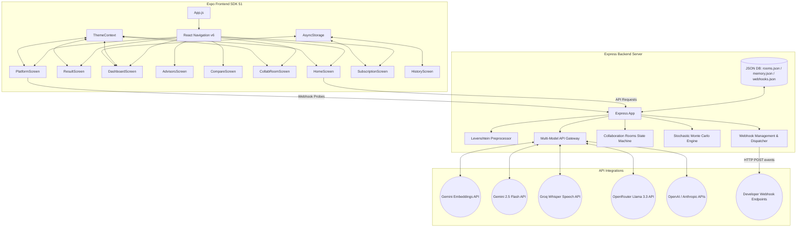

# Decision Simulator AI 🧠🌌

[](https://nodejs.org/)
[](https://reactnative.dev/)
[](https://expo.dev/)
[](https://ai.google.dev/)
[](https://groq.com/)
[](LICENSE)

An advanced, industry-grade decision-science and cognitive-modeling platform that combines predictive Generative AI simulations with a premium bioluminescent sci-fi terminal interface. 

*Decision Simulator AI* pre-processes user query variables, calculates emotional and cognitive distortions, runs parallel multi-model consensus reviews, projects 10,000-run Box-Muller Monte Carlo timeline models, simulates multi-perspective board debates, and coordinates real-time group collaboration rooms.

---

## ⚡ Core Architecture Capabilities

### 1. AI-Driven Voice Dictation & Input Normalization
* **Whisper Audio Dictation**: Record and transcribe vocal query dictations directly from your mobile device using the **Groq Whisper** (`whisper-large-v3`) API.
* **Levenshtein Spelling Autocorrection**: Inputs are cleaned against a custom reference vocabulary using a custom Levenshtein distance algorithm to fix spelling errors (e.g., *"desrt"* ➔ *"desert"*, *"stomacth"* ➔ *"stomach"*).
* **Semantic Standardization**: Automatically strips conversational prefixes (e.g., *"please help me decide if I should..."*) and reframes inputs into clear, analytical statements.

### 2. Advanced Cognitive & Emotional Modeling
* **Cognitive Bias Engine**: Evaluates decision statements for Loaded Language, Temporal Discounting, Loss Aversion, and False Dichotomies. It generates a **Bias Score (0-100)** alongside detailed academic explanations.
* **Emotional Intensity Engine**: Gauges the emotional intensity of inputs (e.g., urgency, fear, stress). If the intensity exceeds `50`, the engine flags a cognitive distortion and formulates an objective **Cooldown Reframe**.
* **Socratic Probing Mode**: Before committing to a simulation, the user can engage a Socratic prompter that generates 3 to 5 customized, context-aware probing questions (using the Gemini API or a local heuristic fallback) to clarify hidden variables.

### 3. Stochastic & Branching Simulations
* **Monte Carlo Decile Distributions**: Executes a 10,000-run stochastic simulation using a Box-Muller transform to plot probability decile bin distributions across **1, 3, 5, and 10-year horizons**.
* **Branching Consequence Explorer**: Renders 1st, 2nd, and 3rd order branching outcomes in an interactive, visual decision tree.

### 4. Agentic Boardroom Debates & Custom Advisor Panels
* **Structured Perspectives**: Simulates a systems-level debate between default advisor lenses (Logical & Behavioral vs. Risk & Sustainability) and compiles a single-sentence consensus.
* **Custom Advisor Panel Builder**: Create a specialized panel of up to 3 custom advisors by defining their name, domain expertise (Finance, Tech, Relationships, Health, Wellness, Engineering), and risk appetite profile.

### 5. Multi-Model AI Consensus Engine
* **Parallel Query Dispatching**: Configurable to fire simulation queries in parallel to multiple models (e.g., `gemini-2.5-flash`, `groq/llama-3.3-70b`, `openrouter/llama-3.3-70b`, `gpt-4o-mini`, `claude-3-5-sonnet`).
* **Consensus Index & Variance Logs**: Computes a Group Consensus Score based on average bias levels, emotional intensities, and primary emotion categorizations, detailing exactly where models align or diverge in their reasoning.

### 6. Semantic Memory & Vector Search Recall
* **Gemini Text Embeddings**: Generates local vector embeddings for incoming queries.
* **Cosine Similarity Matcher**: Runs a memory lookup (`threshold >= 0.82`) against past simulations saved in the local database, automatically flagging temporal links and correlations to older decisions.

### 7. Real-Time Group Collaboration Rooms
* **Lobby System**: Hosts on the **Teams** tier can create a collaborative room, generating a unique 5-character room code.
* **Consensus Aggregator**: Remote participants join, choose their decision personality profile (Analytical, Risk-taker, Emotional, Balanced), and submit suitability ratings (1-5 scale) for each future scenario. The room aggregates ballots, computes a weighted agreement index, and highlights the group-recommended pathway.

### 8. Analytics Console & sparkline charts
* **Personal Dashboard**: Charts the user's average bias levels, emotional toll, and outcome calibration ratios. It plots a visual sparkline tracking cognitive bias trends across the last 7 simulations and logs prone cognitive fallacies and trigger frequencies.
* **Organizational Dashboard**: Displays consolidated enterprise metrics, active rooms, room score variance, and department-level bias/stress heatmaps.

### 9. Developer Integrations & Webhooks
* **Public APIs**: Exposes endpoints secured with Bearer Tokens (`Authorization: Bearer ds_live_...`).
* **Webhooks Subscriptions**: Register target HTTP endpoints to dispatch diagnostic JSON payloads on simulation completion.
* **Latency Probe Tester**: Interactive developer console allowing developers to dispatch test payloads, measuring response latency, status codes, and headers directly from the terminal.

---

## 🏗️ Architecture Topology



---

## 📂 Source Code Layout

```
.
├── backend/
│   ├── data/                   # Server JSON databases
│   │   ├── memory.json         # Embeddings & historical search
│   │   ├── rooms.json          # Collaboration room logs
│   │   └── webhooks.json       # Configured webhooks list
│   ├── server.js               # Express app, Monte Carlo, preprocessor, and LLM routes
│   ├── test-local.js           # Local HTTP endpoint diagnostics
│   ├── test-collab.js          # Room lobby & voting integration test
│   ├── test-post.js            # Gemini connection test
│   ├── package.json            # Backend dependency configuration
│   └── .env                    # System environment variables
│
└── frontend/
    ├── src/
    │   ├── components/         # Reusable Custom UI Components
    │   │   ├── Button.js
    │   │   ├── Card.js
    │   │   ├── Dropdown.js
    │   │   ├── ProgressBar.js
    │   │   └── ScenarioCard.js
    │   ├── context/
    │   │   └── ThemeContext.js # Color styles & fonts loading
    │   ├── screens/            # Application Screens
    │   │   ├── HomeScreen.js       # Inputs, Socratic mode & microphone dictation
    │   │   ├── ResultScreen.js     # Simulations, charts, and debate transcript
    │   │   ├── AdvisorsScreen.js   # Panel configurations
    │   │   ├── DashboardScreen.js  # Personal & Organizational stats, Sparkline SVG
    │   │   ├── CollabRoomScreen.js # Real-time lobby and voting matrix
    │   │   ├── PlatformScreen.js   # Webhooks console and tester terminal
    │   │   ├── CompareScreen.js    # Side-by-side decision comparer
    │   │   ├── HistoryScreen.js    # Local logs index
    │   │   └── SubscriptionScreen.js # Billing simulation control
    │   ├── services/
    │   │   ├── api.js              # Network request mappings
    │   │   └── storage.js          # Local AsyncStorage mappings
    │   └── styles/
    │       └── theme.js            # bioluminescent & dark HSL tokens
    ├── App.js                  # Navigation router bootstrap
    ├── app.json                # Expo setup configurations
    └── package.json            # React Native dependencies
```

---

## 🔌 API Reference

### Core Endpoints

| Endpoint | Method | Description | Auth Required |
| :--- | :--- | :--- | :--- |
| `/simulate` | `POST` | Primary simulation request. Triggers spelling preprocessor, memory vector lookup, parallel LLM execution, Box-Muller stochastic models, and webhook dispatches. | No (Local Developer Interface) |
| `/transcribe` | `POST` | Transcribes a base64 encoded audio clip (WEBM, M4A, or WAV format) using the Groq Whisper Speech API. | No |
| `/socratic-questions` | `POST` | Returns 3 to 5 customized probing questions to help a user refine their decision query before simulation. | No |

#### Request Body - `/simulate`
```json
{
  "decision": "should i quit my desrt job now",
  "risk": "high",
  "personality": "analytical",
  "advisors": [
    { "name": "Sarah", "domainExpertise": "finance", "riskAppetite": "low", "description": "Asset management lead" }
  ]
}
```

---

### Collaboration Room Endpoints (Teams Tier Only)

| Endpoint | Method | Description |
| :--- | :--- | :--- |
| `/api/collab/create` | `POST` | Host creates a room lobby. Pre-generates the simulation payload and creates a 5-character code. |
| `/api/collab/join` | `POST` | Remote participant joins a lobby code with a name and decision personality. |
| `/api/collab/start` | `POST` | Room host changes lobby status to `voting`. |
| `/api/collab/vote` | `POST` | Participant casts suitability votes (1-5 score) for each scenario. |
| `/api/collab/room/:code` | `GET` | Returns current metadata state, participants, votes, and consensus calculations for a code. |

---

### Developer Console Endpoints

| Endpoint | Method | Description | Auth Required |
| :--- | :--- | :--- | :--- |
| `/api/v1/simulate` | `POST` | Exposes the simulation engine to public integrations. | Yes (`Bearer ds_live_test_key`) |
| `/api/webhooks` | `GET` | Lists all registered webhook endpoints. | No |
| `/api/webhooks/register`| `POST` | Binds a new target URL endpoint to capture simulation events. | No |
| `/api/webhooks/:id` | `DELETE`| Removes a registered webhook endpoint. | No |
| `/api/webhooks/test` | `POST` | Sends a diagnostic test payload to a target URL, logging HTTP status and roundtrip latency. | No |

---

## 🔧 Installation & Configuration

### Prerequisites
* **Node.js** (v18+)
* **npm** (v9+)
* **Expo Go App** (installed on physical iOS or Android devices to test native features)

### 1. Backend Setup
1. Navigate to the `backend/` directory:
   ```bash
   cd backend
   ```
2. Install Node dependencies:
   ```bash
   npm install
   ```
3. Create a `.env` file in the `backend/` folder and populate it with your keys:
   ```env
   PORT=3000
   
   # Core Gemini API Configuration
   GEMINI_API_KEY=YOUR_GOOGLE_GEMINI_API_KEY
   
   # Groq API Configuration (for Voice Dictation Whisper)
   GROQ_API_KEY=YOUR_GROQ_API_KEY
   
   # Multi-Model AI Consensus Engine Setup (Optional)
   PRIMARY_MODEL=gemini/gemini-2.5-flash
   CONSENSUS_MODEL_1=groq/llama-3.3-70b-versatile
   CONSENSUS_MODEL_2=openrouter/meta-llama/llama-3.3-70b-instruct:free
   
   # Additional Consensus Keys (Optional)
   OPENROUTER_API_KEY=YOUR_OPENROUTER_API_KEY
   OPENAI_API_KEY=YOUR_OPENAI_API_KEY
   ANTHROPIC_API_KEY=YOUR_ANTHROPIC_API_KEY
   ```
4. Start the Express server:
   ```bash
   npm start
   ```
   The server will start listening at `http://localhost:3000`.

### 2. Frontend Setup
1. Navigate to the `frontend/` directory:
   ```bash
   cd ../frontend
   ```
2. Install React Native dependencies:
   ```bash
   npm install
   ```
3. Boot the Expo development server:
   ```bash
   npx expo start --tunnel
   ```
   
   > [!NOTE]
   > The `--tunnel` flag is highly recommended when debugging on physical mobile devices. It routes your requests securely via an ngrok tunnel, allowing the **Expo Go** application on your phone to talk to your local backend server (`localhost:3000`) without hardcoded IP adjustments.

4. Open the **Expo Go** app on your physical mobile device and scan the QR code displayed in your terminal. Alternatively, press `w` in your terminal to boot in your browser web emulator.

---

## 🧪 Integration Verification Tests

The platform includes local test scripts to verify connectivity, endpoint structures, and room state-machines before deployment.

### 1. Direct LLM Connection Test
Verifies connection to the Google Gemini model and measures response latency.
```bash
cd backend
node test-post.js
```

### 2. Endpoint Simulation Diagnostic
Tests spelling corrections, normalization, cognitive bias score calculations, and Box-Muller Monte Carlo iterations on four distinct test cases.
```bash
node test-local.js
```

### 3. Collaboration Room Walkthrough Test
Simulates a multi-user collaborative room cycle (lobby formation, participant joining, voting submission, weighted consensus calculations, and room completion verification).
```bash
node test-collab.js
```

---

## 🛡️ Cognitive Science Disclaimer

*Decision Simulator AI* models future probabilities based on behavioral science heuristics, natural language processing, and stochastic probability distributions. Simulations represent theoretical projections and logical exercises. Under no circumstances should these simulations be considered direct financial, professional, medical, or legal advice. Every decision carries unique real-world variables; maintain independent agency and exercise personal caution.
